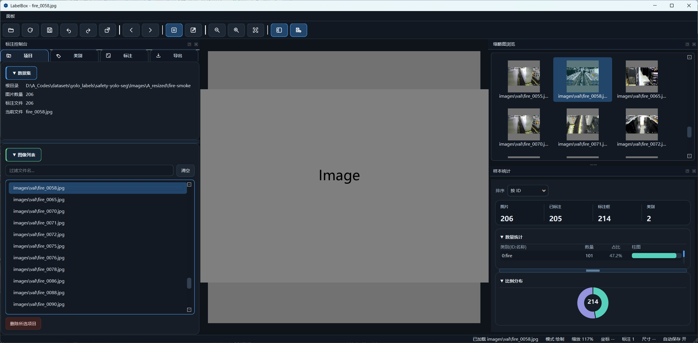

# LabelBox

一个基于 PyQt6 的桌面标注工具，面向目标检测/数据清洗场景，支持类别管理、标注编辑、数据集统计、批量格式转换与目标尺寸导出。

## 效果图



## 核心功能

- 多格式标注读写：支持 `YOLO TXT`、`LabelMe JSON`、`Pascal VOC XML`。
- 类别管理：新建/重命名/删除类别，类别 ID 重映射，YAML 同步。
- 冲突处理：类别 ID 冲突时支持交换或合并迁移。
- 批量数据操作：
	- 批量转换标注格式
	- 多数据集合并（统一类别映射）
	- 目标尺寸导出（支持 Letterbox，标签同步变换）
- 项目列表删除：支持批量删除图片+标注，并支持撤销/重做。
- 标注编辑体验：拖拽、缩放、框选、快捷键移动、重命名、删除。
- 统计面板：按类别统计标注数量、图片数量等信息。
- 可视化设置：标签背景透明度、标签名称/ID显示开关。
- 快捷键系统：内置快捷键编辑窗口，支持冲突检测与持久化保存。

## 运行环境

- Python `3.10+`（建议）
- Windows（当前项目主要在 Windows 环境迭代）

## 依赖安装

在项目根目录执行：

```bash
pip install PyQt6 numpy opencv-python pyyaml
```

说明：`pyyaml` 为可选依赖（用于更完整的 YAML 读写体验），未安装时工具仍可运行基础流程。

## 启动方式

在项目根目录执行任一命令：

```bash
python -m labeltool
```

不要使用 `showme2.py`，当前工作区里没有这个启动脚本。

## 基本使用流程

1. 打开数据集根目录。
2. 在图像列表中选择图片开始标注。
3. 在类别页签维护类别与 ID。
4. 在标注页签修改框、切换类别、删除框。
5. 在导出页签执行批量转换/尺寸导出/多数据集合并。
6. 在设置页签调整自动保存、可视化参数、快捷键。

## 默认快捷键（可在设置中修改）

- `Ctrl+S`：保存当前标注
- `Ctrl+Shift+S`：导出当前标注
- `Ctrl+Z`：撤销
- `Ctrl+Y` / `Ctrl+Shift+Z`：重做
- `W` / `Alt+Left`：上一张
- `S` / `Alt+Right`：下一张
- `N`：切换绘制模式
- `E`：切换编辑模式
- `R` / `F2`：重命名选中框类别
- `Delete`：删除选中框或项目列表中选中项
- `F5`：刷新数据集

## 目录结构

```text
labeltool/
├─ archives/                    # 项目效果图
├─ labeltool/
│  ├─ app.py                    # GUI 入口
│  ├─ constants.py              # 主题与常量
│  ├─ models.py                 # 数据模型
│  ├─ services/                 # 业务服务层
│  └─ ui/                       # 界面与交互层
└─ README.md
```

## 常见问题

### 为什么直接运行 main_window.py 会失败？

`main_window.py` 依赖应用初始化上下文（样式、应用级设置、入口装配），请通过：

- `python -m labeltool`

启动。

## 免责声明

本项目用于数据标注与数据集处理，请在操作前做好数据备份，尤其是批量删除、批量改写类操作。

